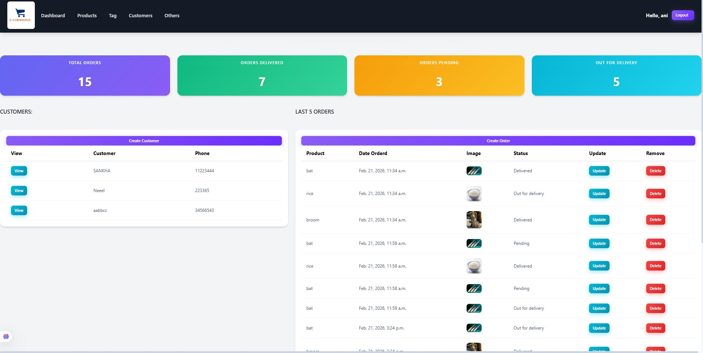

# 🧾 Django CRM System

A simple yet powerful **Customer Relationship Management (CRM)** web application built with **Django**.  
This project manages **Customers, Products, Orders, and Tags** with full CRUD functionality.

---

## Credentials
```yaml
- Username -> ani
- Password -> ani
```

---

## 🚀 Features

### 👤 Customer Management
- Create, update, and delete customers
- View individual customer details
- Track all orders per customer

### 📦 Product Management
- Add products with categories (Indoor / Outdoor)
- Attach multiple tags to products

### 🏷️ Tag System
- Many-to-Many relationship with products
- Flexible categorization

### 📋 Order Management
- Create, update, and delete orders
- Track order status:
  - Pending
  - Out for Delivery
  - Delivered

### 📊 Dashboard
- Total number of orders
- Delivered orders count
- Pending orders count
- Orders out for delivery

---

## 🛠️ Tech Stack

- Backend: Django (Python)
- Frontend: HTML, CSS, Bootstrap
- Database: SQLite (default)

---

## 📁 Project Structure

project/
│
├── acc/
│ ├── models.py
│ ├── views.py
│ ├── forms.py
│ ├── urls.py
│ ├── templates/
│ │ └── acc/
│ │ ├── dashboard.html
│ │ ├── customer.html
│ │ ├── customer_form.html
│ │ ├── order_form.html
│ │ ├── delete.html
│ │ └── delete_customer.html
│
├── db.sqlite3
├── manage.py

---

## ⚙️ Installation & Setup

```yaml
cd PROJECT_MAIN FOLDER_NAME
cd PROJECT_FOLDER
cd env
cd scripts
activate
cd..
cd..
python manage.py runserver
```
```yaml
http://127.0.0.1:8000/
```

---

## 🧠 Key Concepts Used

- Django Models & ORM
- ModelForms
- CRUD Operations
- Template Rendering
- URL Routing
- ForeignKey & ManyToMany Relationships
- CSRF Protection
- POST-Redirect-GET pattern

---

## 📸 Preview



---

## 🤝 Contributing
```
Contributions are welcome!
Fork the repo and submit a pull request.
```

---

## 👨‍💻 Author

Made with ❤️ by Anirban Banerjee

---

Code ☕ Coffee 🔁 Repeat
